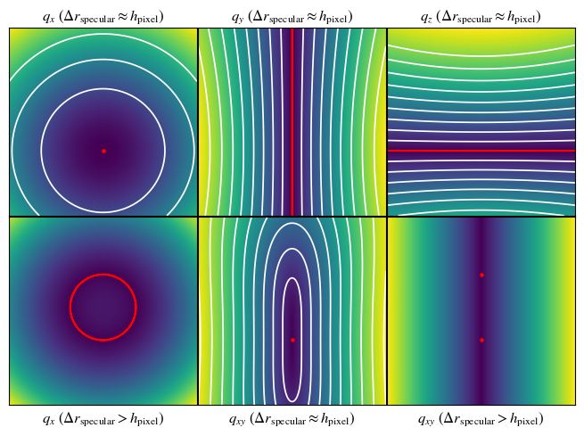

# Assumed Geometry

Currently, this calculation only supports geometries where the incident beam in perpendicular to the detector and the sample is brought into the beam path. This means that the point of normal incidence (PONI) on the detector and the incident beam center are the same points. The calculation could be expanded to situations where the detector is in different relative positions to the beam, but I currently have no plans to implement this currently (feel free to contact me regarding this).

# The Detector

Currently, this calculation assumes the top-left pixel of the detector is the origin, but accepts a beam center vertical distance from the bottom of the detector to be easily compatible with pyFAI's conventions. Since we are assuming the beam center and the PONI are the same, the function takes the values that would be saved in a pyFAI *.poni file. Meaning `beam_center_x_m` would be PONI2 and `beam_center_y_m` would be PONI1. The function will convert these from distances, in meters, from the bottom-left of the detector, to distances, in pixels, from the top-left of the detector (looking at the detector from the sample).

# The Transformation

The *forbidden wedge* transformation is due to the fact that, in the sample frame (where the $c$-axis of the crystal is the $z$-axis of the frame), the $q$-vector has $x^{(S)}$, $y^{(S)}$, and $z^{(S)}$ components unless the incident angle $\alpha_i$ is equal to the scattered angle (toward the $z$-axis) $\alpha_s$. The geometry is shown in (a) of the above figure, which can be used to show that the incident and scattering wavevectors in the sample frame are

$$\begin{equation}
\begin{split}
    \mathbf{k}_i &= \frac{2\pi}{\lambda}
    \begin{bmatrix}
        \cos{\alpha_i}\\
        0\\
        -\sin{\alpha_i}
    \end{bmatrix}^{(S)},\\
    \mathbf{k}_s &= \frac{2\pi}{\lambda}
    \begin{bmatrix}
        \cos{\alpha_s}\cos{\phi_s}\\
        \cos{\alpha_s}\sin{\phi_s}\\
        \sin{\alpha_s}
    \end{bmatrix}^{(S)},
\end{split}
\end{equation}$$

where the $(S)$ superscript signifies the vector is in the basis of the sample frame. The $q$-vector is

$$\begin{equation}
    \mathbf{q} = \mathbf{k}_s - \mathbf{k}_i = \frac{2\pi}{\lambda}
    \begin{bmatrix}
        \cos{\alpha_s}\cos{\phi_s} - \cos{\alpha_i}\\
        \cos{\alpha_s}\sin{\phi_s}\\
        \sin{\alpha_s} + \sin{\alpha_i}
    \end{bmatrix}^{(S)}.
\end{equation}$$

Clearly, $q_y$ is zero when $\phi_s=0$, and therefore $q_x$ and $q_y$ are simultaneously zero when $\phi=0$ and $\cos\alpha_s=\cos\alpha_i$, so the only scattered wave with a $\mathbf{q}$ pointing only in the $z$-direction will be when $\phi_s = 0$ and $\alpha_s = \alpha_i$. Since this situation has equal incident and scattered angle, we can refer to it as the \emph{specular condition}.

A signal on the detector will be due to a scattered wave $\mathbf{k}_s$ hitting the detector, and this event will carry information about the corresponding $\mathbf{q}$. However, since the detector is perpendicular to the $\mathbf{k}_i$, it is easier to work in the lab frame (see (b) of the figure above) to determine which pixel on the detector $\mathbf{k}_f$ hits. The lab frame is rotated with $R_y(-\alpha_i)$ from the sample frame, so $\mathbf{k}_s$ in the lab frame is

$$\begin{equation}
    \mathbf{k}_s = R_y(-\alpha_i)\frac{2\pi}{\lambda}
    \begin{bmatrix}
        \cos{\alpha_s}\cos{\phi_s}\\
        \cos{\alpha_s}\sin{\phi_s}\\
        \sin{\alpha_s}
    \end{bmatrix}^{(S)} = \frac{2\pi}{\lambda}
    \begin{bmatrix}
        \cos{(\alpha_s+\alpha_i)}\cos{\phi_s}\\
        \cos{(\alpha_s+\alpha_i)}\sin{\phi_s}\\
        \sin{(\alpha_s+\alpha_i)}
    \end{bmatrix}^{(L)},
\end{equation}$$

where the $(L)$ superscript signifies the vector is in the lab frame basis. When the specular condition is met $(\alpha_i=\alpha_s)$, the scattered wavevector in the lab frame is

$$\begin{equation}
    \mathbf{k}_{s,\text{spec}} = \frac{4\pi}{\lambda}\sin{(2\alpha_i)}\hat{\mathbf{z}}^{(L)},
\end{equation}$$

The above figure shows how the angles $\alpha_i$, $\alpha_s$, and $\phi_s$ determine where a scattered wave will hit the detector. The location $\mathbf{r}$ will have the same direction as $\mathbf{k}_s$ (i.e. $\mathbf{\hat{k}}_s=\hat{\mathbf{r}}$); therefore

$$\begin{equation}
    \mathbf{r} = r
    \begin{bmatrix}
        \cos{(\alpha_s+\alpha_i)}\cos{\phi_s}\\
        \cos{(\alpha_s+\alpha_i)}\sin{\phi_s}\\
        \sin{(\alpha_s+\alpha_i)}
    \end{bmatrix}^{(L)} = 
    \begin{bmatrix}
        d_{s\text{-}d}\\
        r_{y^{(L)}}\\
        r_{z^{(L)}}
    \end{bmatrix}^{(L)},
\end{equation}$$

where

$$\begin{equation}
    r = \sqrt{d_{s\text{-}d}^2 + r_{y^{(L)}}^2 + r_{z^{(L)}}^2}.
\end{equation}$$

However, the detector's origin is the top-left pixel of the CCD array (see the figure above). This leads to one last transformation from the lab frame to the detector frame where

$$\begin{equation}
\begin{split}
    x^{(D)} &= b_x - r_{y^{(L)}},\\
    y^{(D)} &= b_y - r_{z^{(L)}}.
\end{split}
\end{equation}$$

So a detection event at a pixel ($x^{(D)}, y^{(D)}$) corresponds to scattering angles $\alpha_s$ and $\phi_s$ through the following relationship

$$\begin{equation}
\begin{split}
    x^{(D)} &= b_x - \cos{(\alpha_s+\alpha_i)}\sin{\phi_s}\sqrt{d_{s\text{-}d}^2 + (b_x - x^{(D)})^2 + (b_y - y^{(D)})^2}\\
    y^{(D)} &= b_y - \sin{(\alpha_s+\alpha_i)}\sqrt{d_{s\text{-}d}^2 + (b_x - x^{(D)})^2 + (b_y - y^{(D)})^2}\\
\end{split}
\end{equation}$$

$$\begin{equation}
\begin{split}
    \alpha_s &= \sin^{-1}\bigg(\frac{b_y-y^{(D)}}{\sqrt{d_{s\text{-}d}^2+(b_x-x^{(D)})^2+(b_y-y^{(D)})^2}}\bigg)-\alpha_i\\
    \phi_s &= \sin^{-1}\bigg(\frac{b_x-x^{(D)}}{\sqrt{d_{s\text{-}d}^2+(b_x-x^{(D)})^2}}\bigg)
\end{split}
\end{equation}$$

The $q$-vector can then be calculated with these angles using the equation relating $q$ to the scattering angles. 

The above plots show the amount of $q$ in each direction based on distance from the beam center on the detector. The lines are contour lines, with red signifying when the vector is 0 in this direction.
